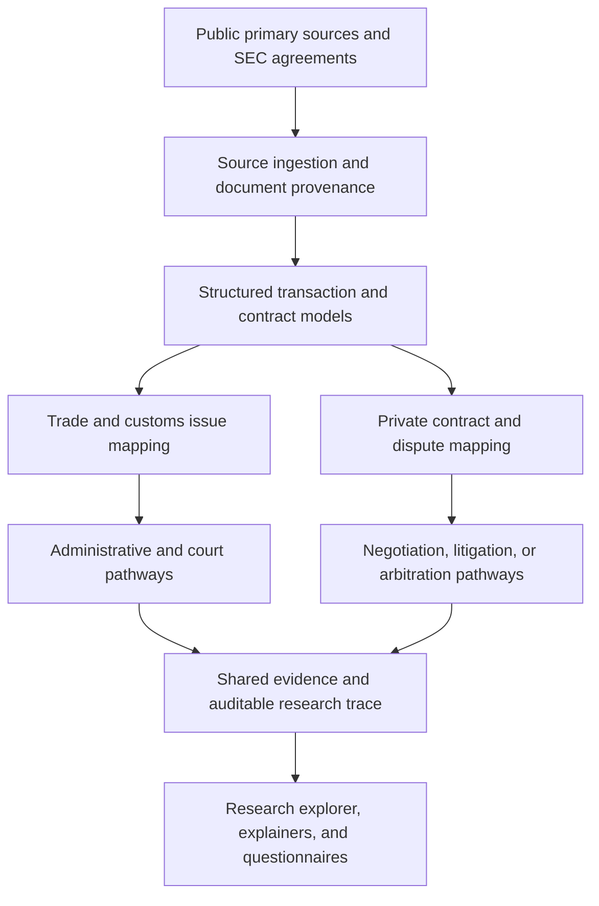

# Tradeopedia Framework

**A transaction-centered framework for U.S. trade law, cross-border contracts, and international commercial dispute resolution.**

[Tradeopedia.trade](https://tradeopedia.trade/) · **Legal System Labs** (research companion; in development) · [Technical specification](TRADEOPEDIA_FRAMEWORK.md)

> **Project status — research / architecture (`0.1.0-draft`).** This repository currently documents a proposed system, research methodology, and implementation roadmap. Diagrams, interfaces, data models, and integrations described here are design proposals unless specifically documented as built and tested. This is not a production compliance service or an automated legal decision-maker.

## Research premise

An import transaction is not merely a customs entry. It is a chain of commercial agreements, product and component origins, payments, logistics records, declarations, government decisions, and possible disputes. Each participant may have different statutory duties and contractual rights.

The framework treats the **transaction trajectory** as its primary analytical object. It aims to link evidence across the product lifecycle and distinguish two related—but legally separate—sets of questions:

1. **Public-law obligations and remedies:** importer-of-record (IOR) duties, customs entries, CBP actions, administrative processes, and judicial review, including proceedings before the U.S. Court of International Trade where applicable.
2. **Private commercial rights and remedies:** contractual warranties, indemnities, payment and delivery obligations, governing law, the CISG, litigation, arbitration agreements, and recognition or enforcement of awards.

An arbitration clause does **not** itself provide a remedy against CBP, and shifting cost by contract does **not** automatically transfer statutory IOR obligations.

## System overview



The proposed technical architecture combines source adapters, typed records, clause extraction, deterministic issue flags, evidence provenance, and optional *constrained* model-assisted analysis. Outputs should retain citations, assumptions, missing information, and explicit uncertainty.

For the full architecture, data models, Mermaid diagrams, candidate API contracts, and milestones, see **[TRADEOPEDIA_FRAMEWORK.md](TRADEOPEDIA_FRAMEWORK.md)**.

## Research tracks

| Track | Central question | Planned research output |
| --- | --- | --- |
| Import transaction graph | Who did what, when, and on the basis of which records? | Structured parties, products, shipments, documents, and event history |
| Customs and IOR responsibilities | What public-law issues arise, and what procedures may apply? | Source-linked issues, documentary gaps, and procedural maps |
| Contract risk allocation | How do agreements allocate origin, tariffs, records, delivery, indemnity, and cooperation risks? | Clause-level comparisons and exception flags |
| International sales law | Which facts and clauses affect CISG and governing-law analysis? | Research checklists and jurisdiction-sensitive issue maps |
| Commercial dispute resolution | Is there a valid arbitration agreement, and what alternative pathways require examination? | Separate litigation/arbitration procedural maps and evidence checklists |
| Evidence and reproducibility | Can a researcher retrace each observation to its source? | Versioned source manifest, citations, annotations, and decision traces |

## Initial dataset: SEC contract research

The first research milestone is a **curated sample of approximately 10–20 publicly filed agreements from SEC EDGAR**, selected and annotated according to a documented sampling protocol. The goal is not to treat SEC exhibits as universal model contracts, but to study observed clause patterns and omissions.

Initial fields of interest include:

- Parties, transaction subject, effective date, and publicly disclosed context
- Delivery terms and Incoterms references (where present)
- Importer-of-record designation and customs cooperation
- Tariff, tax, origin, classification, and documentation provisions
- Representations, warranties, indemnity, liability limits, and notice periods
- Governing law, CISG inclusion or exclusion, forum selection, and arbitration language
- Dispute procedure, arbitral seat/institution (if specified), and enforcement considerations

Each extracted observation should link to the filing or document location and identify whether it is a verbatim clause, a human annotation, a deterministic flag, or an unverified model-generated suggestion. **No corpus has been represented here as collected or validated yet.**

## Candidate source systems

- [SEC EDGAR](https://www.sec.gov/edgar/search/) — public filings and contract exhibits
- [CBP CROSS](https://rulings.cbp.gov/) — customs rulings
- [U.S. Code](https://uscode.house.gov/) and [Federal Register](https://www.federalregister.gov/) — federal legal authorities and rulemaking
- [U.S. Court of International Trade](https://www.cit.uscourts.gov/) and [CourtListener](https://www.courtlistener.com/) — selected decisions and docket/research metadata
- [UNCITRAL CISG](https://uncitral.un.org/en/texts/salegoods/conventions/sale_of_goods/cisg) and [UNCITRAL arbitration materials](https://uncitral.un.org/en/texts/arbitration) — international sales and arbitration instruments

These are *candidate sources*, not evidence of live or authorized integrations. Fetching, licensing, use restrictions, access policies, versioning, and authority status must be evaluated per source.

## Engineering principles

1. **Primary-source traceability:** every material statement or extracted clause has a source identifier, location, and retrieval/version metadata.
2. **Separation of law and contract:** government obligations, private claims, and adjudicative jurisdiction remain distinct objects.
3. **Uncertainty by design:** missing evidence and unresolved legal questions produce explicit qualifications or abstention—not a false clearance result.
4. **Reproducible research:** preserve sampling criteria, normalized schemas, tests, and corrections.
5. **Data minimization:** keep client-confidential, privileged, nonpublic customs, and secret material out of public datasets.
6. **Modular integrations:** any language-model or external reasoning service is optional, replaceable, and constrained by source retrieval and validation.

## Planned repository structure

```text
tradeopedia-framework/
├── README.md
├── TRADEOPEDIA_FRAMEWORK.md       # foundational technical specification
├── docs/                          # architecture decisions and methodology (planned)
├── research/                      # public corpus manifests and annotations (planned)
├── packages/                      # schemas, adapters, parsers, engines (planned)
├── examples/                      # synthetic transaction examples (planned)
└── tests/                         # automated verification (planned)
```

Only files actually committed to GitHub should be interpreted as present. See the technical specification for a more detailed **proposed**, not implemented, directory layout.

## Development roadmap

- [x] Establish initial architecture and research scope in `TRADEOPEDIA_FRAMEWORK.md`
- [ ] Adopt architecture decision records (ADRs), source manifest, and data dictionary
- [ ] Select and annotate an initial SEC agreement corpus
- [ ] Implement and validate source ingestion and typed transaction records
- [ ] Build contract clause extraction with traceable citations
- [ ] Model independent customs and private-dispute pathways
- [ ] Implement arbitration-agreement and CISG research checklists
- [ ] Add validation fixtures, tests, and a read-only research explorer

These checkboxes report documentation and implementation progress, not legal or regulatory approval.

## Relationship to the public projects

**[Tradeopedia.trade](https://tradeopedia.trade/)** publishes accessible explanations and visual models of U.S. trade-law issues. **Legal System Labs** is the developing research companion for working papers, contract datasets, documented experiments, and comparative analysis. **This repository** is intended to hold version-controlled specifications, source code, schemas, synthetic examples, tests, and methods as they are developed.

## Stewardship and reuse

**Maintainer:** Emma D. Enriquez  
**Status:** Independent legal-technology research project  
**License:** Not selected. Public visibility does not itself grant a general license to copy, adapt, distribute, or reuse the repository's contents. Contributions and licensing policies will be documented before inviting outside contributions.

For public project information, visit [Tradeopedia.trade](https://tradeopedia.trade/).

### Disclaimer

This repository is for technical research and general educational use. It is not legal advice, does not establish an attorney–client relationship, does not determine legal compliance, and must not be relied upon to make filing, customs, litigation, arbitration, or other legal decisions. Sources and procedures must be independently verified for the relevant facts, law, dates, jurisdiction, and procedural posture.
