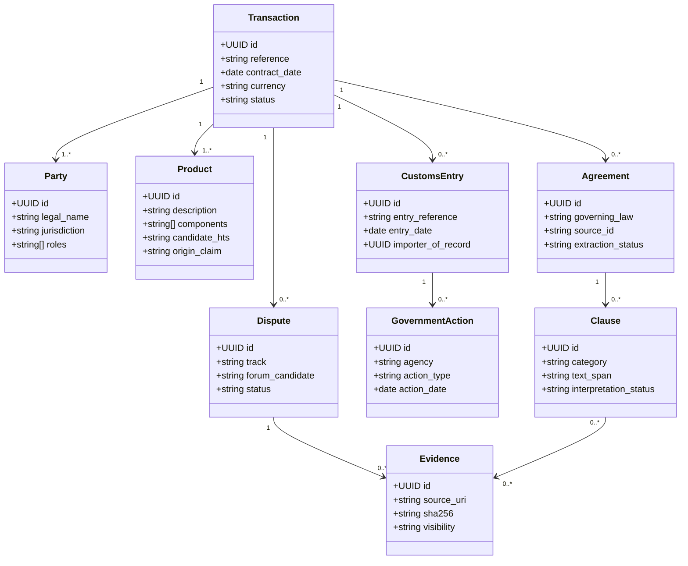
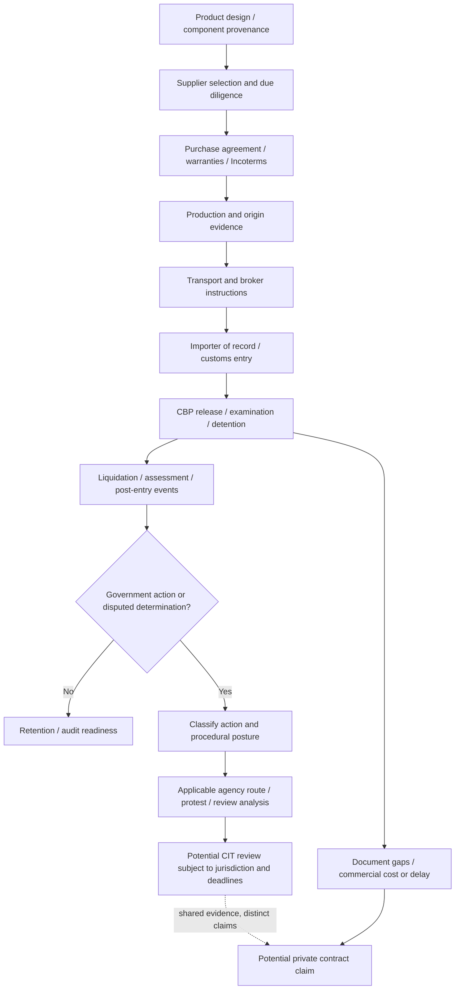
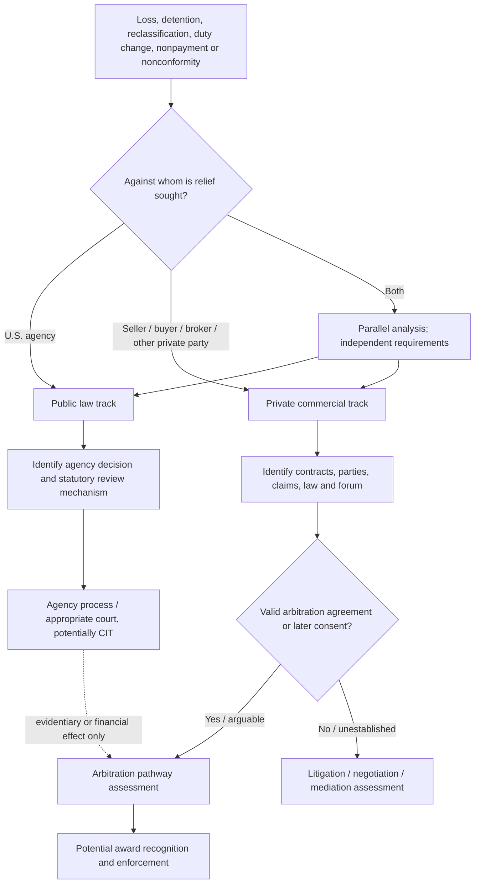
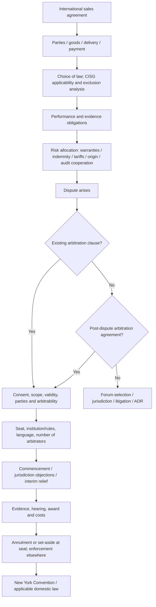
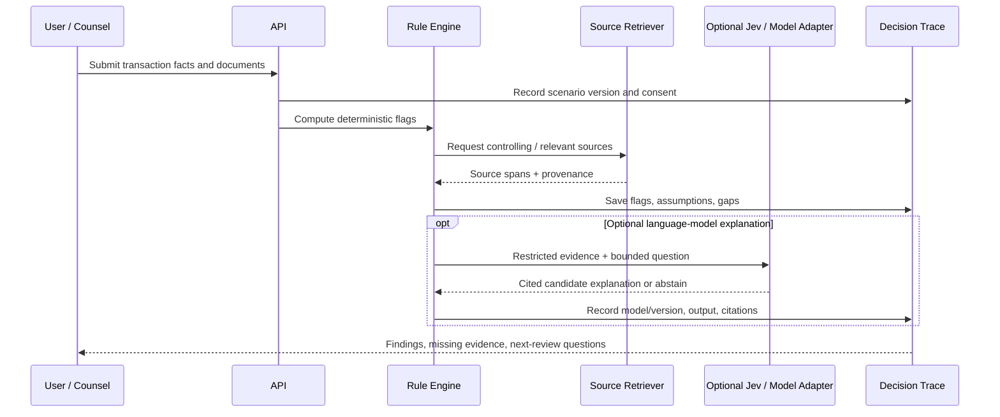
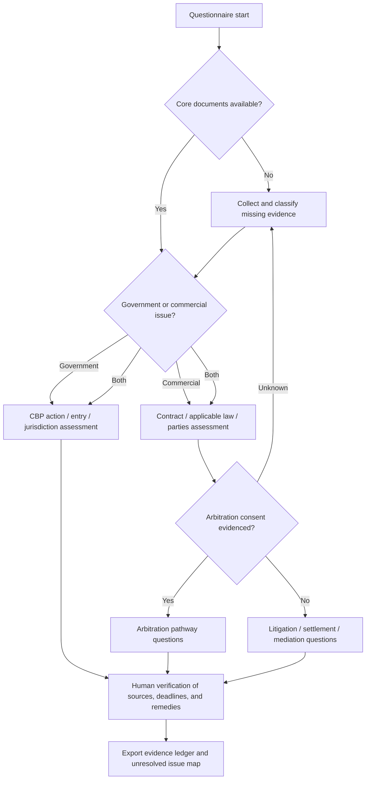

# Tradeopedia / Legal System Labs

## Technical Framework: U.S. Import Transactions, Trade Compliance, Commercial Disputes, and International Arbitration

**Status:** Working architecture / proposed implementation  
**Version:** `0.1.0-draft`  
**Last updated:** 2026-10-07  
**Project:** [Tradeopedia](https://tradeopedia.trade/) · Legal System Labs (research and development companion)  
**Maintainer:** Emma D. Enriquez  
**Scope:** U.S. federal trade law, international sale of goods, contract risk allocation, and private cross-border dispute resolution  
**License:** To be selected before public contributions or code reuse; no license is implied by publication.

> **Repository status notice:** This document specifies a proposed system and a research agenda. A component described here is **not** represented as implemented, validated, connected to an external API, or approved for production unless explicitly marked as such in a separate implementation inventory. All scenarios and risk assessments are educational and require independent legal and factual review.

---

## 1. Abstract

**Tradeopedia** models an import not as a single customs entry but as a sequence of interconnected legal, commercial, documentary, and regulatory events. The analytical unit is the **transaction trajectory**: a product, its component and supplier provenance, the purchase agreement, transport and customs records, the importer-of-record (IOR) obligations, government action, and potential contractual recourse against private parties.

The **international arbitration component** adds a separate, connected legal track for disputes between buyers, sellers, manufacturers, distributors, logistics providers, insurers, and other private parties. It must not collapse public-law customs review into contractual dispute resolution. A CBP determination may create loss or expose an evidentiary inconsistency; contractual rights and arbitral jurisdiction still depend on the underlying agreements, applicable law, and independently established facts.

The platform's initial research objective is to index **10–20 publicly filed agreements from SEC EDGAR**, extract selected contractual provisions, link those provisions to primary authorities and relevant cases, and present an auditable, source-grounded comparison. Research findings should remain distinct from automated legal conclusions.

### 1.1 System hypotheses

1. **Transaction-first indexing** produces better issue identification than independent topic searches for tariffs, contracts, and arbitration.
2. **IOR-centered responsibility mapping** exposes asymmetry between public-law liability to CBP and private contractual risk allocation.
3. **Clause-level contract analysis** can identify missing or conflicting risk-transfer terms without claiming those terms are enforceable.
4. **Dual-track dispute mapping** improves understanding of parallel agency, court, commercial litigation, settlement, and arbitration processes.
5. **Evidence provenance and abstention** are architectural requirements, not optional interface features.

### 1.2 Non-goals

- Automated legal advice or assertions that a shipment, contract, party, or transaction is “legally cleared.”
- Automated determination of HTS classification, origin, antidumping/countervailing duties, sanctions status, liability, or arbitration enforceability without validated legal review.
- Treating a customs broker, Incoterm, DDP term, supplier warranty, or arbitration clause as automatically shifting statutory IOR responsibility.
- Treating arbitration as a procedural remedy against CBP or replacing jurisdictional prerequisites for the U.S. Court of International Trade (CIT).
- Ingestion of nonpublic ACE, client contracts, or privileged matter data into a public research database.

---

## 2. Reference architecture

```mermaid
flowchart LR
    subgraph SOURCES[Primary and public source layer]
      SEC[SEC EDGAR agreements]
      CBP[CBP CROSS / public guidance]
      LAW[U.S. Code / CFR / Federal Register]
      COURTS[CIT / appellate decisions / CourtListener]
      INTL[UNCITRAL / treaty texts / institutional rules]
    end
    subgraph PIPELINE[Ingestion and normalization]
      GET[Adapters and fetch jobs]
      RAW[Immutable source snapshots]
      PARSE[Document and clause parser]
      PROV[Provenance / version / citations]
    end
    subgraph MODEL[Typed legal transaction graph]
      TX[Transaction + product + parties]
      DOC[Documents + evidence]
      GOV[Government actions + deadlines]
      PRIV[Contract rights + dispute clauses]
    end
    subgraph ENGINES[Analytical engines]
      RULE[Deterministic issue rules]
      RET[Source-linked retrieval]
      LLM[Optional constrained reasoning adapter]
      TRACE[Auditable decision trace]
    end
    subgraph OUTPUT[User-facing interfaces]
      EXPLAIN[Tradeopedia explainers]
      LAB[Legal System Labs data explorer]
      Q[Importer / counsel questionnaire]
      EXPORT[Evidence and analysis export]
    end
    SOURCES --> GET --> RAW --> PARSE --> PROV
    PROV --> MODEL
    TX --> RULE
    DOC --> RET
    GOV --> RULE
    PRIV --> RULE
    RULE --> TRACE
    RET --> TRACE
    RET --> LLM --> TRACE
    TRACE --> OUTPUT
```



**Design boundary:** deterministic data extraction and issue flags are distinguished from interpretive outputs. Any generative model, including a possible **Jev** adapter, is replaceable, server-side, constrained to retrieved materials, and capable of explicitly declining to answer. “Jev” is an **integration candidate**, not a confirmed API capability or dependency.

### 2.1 Suggested modules

| Package | Responsibility | Planned artifacts |
|---|---|---|
| `sources-sec` | EDGAR filing discovery, exhibit inventory, agreement fetching | accession metadata, agreement snapshots |
| `sources-us-law` | statutes, regulations, Federal Register and CBP rulings | normalized authority references |
| `sources-cases` | CIT, Federal Circuit, and selected related decisions | opinion metadata, procedural posture |
| `sources-arbitration` | treaties, model law materials and public institutional rules | jurisdiction/rules registry |
| `contracts` | Clause parsing and provision taxonomy | clause records and comparisons |
| `transactions` | Product, seller, buyer, IOR, broker, carrier, shipment, and entries | typed transaction graph |
| `customs` | Entry events, documentary gaps, CBP actions, issue triage | review checklist, deadline candidates |
| `disputes` | Agency and court pathways; private claims | parallel-dispute graph |
| `arbitration` | Consent, clause review, institution/seat/law, award enforcement | arbitration eligibility checklist |
| `evidence` | Artifact ledger, provenance, confidence and citations | immutable evidence manifest |
| `reasoning` | Deterministic rules and optional LLM/Jev gateway | abstaining, cited outputs |
| `web` | Research/documentation UI and questionnaire | read-only explorer and reports |

---

## 3. Legal and transactional object model

The core record is a **transaction**, not a legal case. A transaction can have multiple products, entries, agreements, and disputes. A dispute can reference multiple transactions and several distinct legal theories.



### 3.1 Canonical identifiers

- Public filing: SEC Central Index Key (`CIK`) + accession number + document filename.
- Agreement: content digest (`sha256`) plus filing provenance; do not assume identical exhibit filenames represent identical legal instruments.
- Clause: agreement identifier + section hierarchy + start/end offsets + parser version.
- Authority: issuing body, document identifier, section, effective/version dates and canonical URL.
- Case: court identifier, docket/citation, decision date, opinion/version source.
- Transaction: internal UUID; synthetic examples must be tagged `synthetic: true`.

### 3.2 Example typed record (illustrative)

```typescript
type EvidenceRef = {
  sourceId: string;
  uri: string;
  retrievedAt: string; // ISO 8601
  sha256: string;
  section?: string;
  quotedSpan?: { start: number; end: number };
};

type ReviewState = 'unreviewed' | 'machine_extracted' | 'human_verified' | 'contested';

type IssueFinding = {
  id: string;
  transactionId: string;
  track: 'customs_public_law' | 'commercial_private_law';
  issueCode: string;
  observation: string;
  sourceEvidence: EvidenceRef[];
  missingFacts: string[];
  assumptions: string[];
  reviewState: ReviewState;
  conclusion: 'not_determined';
};
```

The **schema should permit uncertainty**: absence of a clause in machine-extracted text is not proof that the executed agreement lacks it.

---

## 4. Import lifecycle and public-law responsibility

### 4.1 Event model



Under **19 U.S.C. § 1484**, the qualifying IOR is required to use reasonable care in entry-related submissions. Allocation of costs or warranties under a private agreement does not, by itself, displace applicable customs statutes. Potential retention and recordkeeping duties must be mapped **by role and record category**, using the applicable statute and regulations, not assigned uniformly to every supplier or broker.

### 4.2 Customs issue classification

A proposed issue detector records facts and routes questions; it does not automatically select a remedy:

| Issue family | Illustrative inputs | System output |
|---|---|---|
| Classification / HTS | product specification, component list, ruling | candidate inconsistency and missing evidence |
| Customs valuation | invoice, assists, royalties, related-party facts | transaction-value issue checklist |
| Origin / marking | bill of materials, manufacturing stages | provenance gaps and origin questions |
| Forced labor / UFLPA | supplier chain, site, traceability files | source-linked due diligence checklist |
| AD/CVD | product description, producer/exporter, order references | potential scope and cash-deposit questions |
| Import restrictions | product, country, agency requirements | other-government-agency referral flags |
| Entry / recordkeeping | entries, broker transmissions, retention ledger | document request and audit-readiness status |
| CBP dispute | notice, decision, date and entry status | possible procedural routes; human deadline review |

**Deadline policy:** no filing or protest date is emitted as legally controlling until the specific action, governing provision, service/notice dates, exceptions, and jurisdiction have been verified by a human reviewer.

---

## 5. Two dispute tracks, not one

### 5.1 Routing model



**Critical separation:** statutory CBP/CIT matters and private arbitration are not interchangeable. An arbitral tribunal may decide a contractual allocation of loss between consenting private parties where permitted, but does not thereby set aside a CBP action, bind CBP, or assume CIT jurisdiction.

### 5.2 Example: supplier origin warranty versus IOR exposure

**Hypothetical:** an importer pays additional duties or experiences a shipment detention following an origin-document discrepancy; its agreement contains a supplier origin warranty and a dispute clause.

1. **Public track:** preserve entry records and the government notice; determine the exact agency action, legal basis, review mechanism and independently verified deadlines.
2. **Private track:** extract the representation, indemnity, notice, cooperation, limitation-of-liability, causation and dispute-resolution clauses; assess potential remedies without presuming breach.
3. **Parallel evidence:** versioned bills of materials, purchase orders, invoices, supplier representations, production records, broker instructions, communications and notices.
4. **Distinct outcome records:** government action outcome, contract claim outcome, offsets/recovery and unresolved uncertainty.

---

## 6. International sale of goods and arbitration subsystem

### 6.1 Contract-to-dispute graph



### 6.2 Questions the subsystem must preserve

| Category | Required analysis | Do not infer |
|---|---|---|
| CISG | states/place of business, Art. 1 applicability, exclusions, Art. 6 choice, scope and reservations | that choosing “New York law” automatically excludes CISG |
| Contract structure | executed version, order of precedence, purchase-order terms, amendments | that an SEC-filed form equals the executed transaction contract |
| Arbitration consent | parties bound, formation, scope, delegation, validity, non-signatories | that an arbitration clause binds every supply-chain participant |
| Procedure | institutional/ad hoc rules, seat vs venue, language, appointment, emergency relief | that institution, seat, governing law and hearing location are equivalent |
| Merits | performance, notice, causation, defenses, damages, limitation clauses | that CBP duty reassessment automatically proves supplier breach |
| Recognition | award, jurisdiction, Convention applicability and defenses, local enforcement law | that winning an award guarantees collection |

### 6.3 Arbitration-clause data extraction

```json
{
  "clause_type": "dispute_resolution",
  "source_agreement_id": "example-agreement",
  "arbitration_present": "unknown",
  "institution": null,
  "rules": null,
  "seat": null,
  "governing_law": null,
  "language": null,
  "arbitrator_count": null,
  "scope": null,
  "carveouts": [],
  "interim_relief": null,
  "consolidation_joinder": null,
  "source_spans": [],
  "verification_state": "unreviewed"
}
```

`arbitration_present` should be a three-state field (`yes`, `no`, `unknown`) after extraction, never a binary default. A missing clause in a limited filing excerpt remains `unknown`.

### 6.4 CISG analysis and choice-of-law discipline

Treat **CISG** (United Nations Convention on Contracts for the International Sale of Goods) as a potentially applicable substantive sales-law regime, distinct from an arbitration agreement and from the law of the arbitral seat. Evaluate applicability, any effective exclusion, and issues outside CISG scope separately. Avoid assuming either that every international sale is governed by CISG or that a generic domestic-law selection necessarily opts out.

### 6.5 Private claim taxonomy

- Nonconforming goods; documentation warranties; inspection and rejection.
- Origin, classification, valuation-information and regulatory cooperation warranties.
- Indemnification for assessments, penalties, storage, demurrage and defense costs, subject to contract and law.
- Price adjustment; tariff-change clauses; force majeure/hardship; allocation of newly imposed duties.
- Broker / freight-forwarder service agreements and related duties (analyzed separately from the sales agreement).
- Notice, cure, limitations, evidence retention, audit access, third-party claims and insurance.
- Confidentiality, interim measures, expert determination, mediation, litigation, arbitration and award enforcement.

---

## 7. Contract corpus: EDGAR-first research design

**Pilot corpus:** 10–20 publicly accessible SEC-filed international supply, manufacturing, distribution or purchase agreements, selected according to documented criteria. The corpus must be assembled and verified; no claim is made that these agreements have already been downloaded or reviewed.

### 7.1 Sampling protocol

1. Define inclusion/exclusion criteria and a reproducible search log (forms, exhibit type, date range, industry and contract structure).
2. Resolve issuer CIK, accession number, filing URL, exhibit label and exact exhibit URL.
3. Download permitted public documents; respect SEC fair-access policy, identification headers and throttling.
4. Retain original source file, response metadata, timestamp, checksum and text extraction method.
5. Extract clauses with page/section/text offsets and assign `machine_extracted` review state.
6. Independently verify key clauses, redactions, omissions, exhibits incorporated by reference, amendments, and governing version.
7. Publish metadata, selected short source-linked excerpts, annotation methodology and reproducible derived data subject to review of rights and access terms; do not imply confidential treatment omissions are publicly known.

**API distinction:** SEC `data.sec.gov` APIs provide filing submission histories and XBRL data; access to specific filing **exhibits** may require retrieving EDGAR archive files or appropriate public index pages. `companyfacts` is not a contract-text API. `data.sec.gov` does not support cross-origin browser access; use a server-side adapter.

### 7.2 Clause taxonomy (v0)

`party_role`, `product_spec`, `incoterm_delivery`, `ior`, `customs_cooperation`, `origin_warranty`, `classification_support`, `audit_access`, `record_retention`, `tariff_change`, `price_adjustment`, `indemnity`, `liability_cap`, `consequential_damages`, `notice_cure`, `insurance`, `governing_law`, `cisg`, `forum_selection`, `arbitration`, `mediation`, `interim_relief`, `enforcement`, `termination`.

### 7.3 Research views

- **Agreement matrix:** agreement × clause category × source/verification status.
- **Risk allocation map:** importing party versus supplier versus broker duties, with statutory and contractual layers explicitly separated.
- **Comparison explorer:** excerpts, comparable formulations, missing/unknown values, source metadata.
- **Case-to-clause links:** jurisdiction, claim and legal issue annotations; **not** automated precedent matching.
- **Dispute-path visualizer:** independent public and private routes with shared evidence.

---

## 8. Evidence model, retrieval and constrained reasoning



### 8.1 Output contract

Each analytical response must provide:

- **Observed facts** (with evidence links).
- **Assumptions / unknowns** (separately identified).
- **Candidate legal issues** (with controlling or relevant primary sources, where available).
- **Procedural uncertainties** (forum, deadlines, arbitrability, notice).
- **Alternatives requiring review**, never a categorical resolution when facts are incomplete.
- **Audit metadata** (tool, parser/model version, retrieval time, source version and reviewer state).

### 8.2 Abstention and security requirements

- Fail closed for missing source, inconsistent record, questionable effective date, uncertain party identity or unresolved governing instrument.
- Keep third-party/source text in an untrusted data boundary: never execute instructions appearing in a filing or retrieved document.
- Isolate confidential client submissions from the public research corpus; deny default cross-tenant retrieval.
- Redact secrets/PII from logs; use access controls, encryption and retention/deletion rules appropriate to deployment.
- A generated explanation cannot set `human_verified`, change legal status, or trigger a filing.
- Export provenance and a machine-readable decision trace for repeatability.

---

## 9. Importer and in-house counsel questionnaire (schema outline)

Questionnaire responses generate **issue maps and evidence checklists**, not advice or legal clearance.

| Group | Core questions | Derived artifact |
|---|---|---|
| Product | What product, components, declared HTS, origin and manufacturing sites? | product and provenance graph |
| Parties | Who is seller, buyer, IOR, broker, freight forwarder and carrier? | responsibilities matrix |
| Documents | Which agreement, invoice, PO, bill of lading, entry, origin records and broker instructions exist? | missing-document register |
| Government event | Is there a hold, notice, liquidation, reassessment, investigation or other action? Dates? | public-law procedural checklist |
| Commercial claim | What promise, loss, remedy, notice term or limitation is implicated? | contractual issues map |
| Arbitration | Clause or post-dispute agreement? Parties, scope, seat, rules and law? | consent and forum checklist |
| Enforcement | Where are counterparties and potential assets? Other proceedings? | enforcement research questions |
| Confidence | What facts are disputed, unknown or unverified? | abstention/review queue |

### 9.1 Decision tree



---

## 10. Proposed repository organization

```text
tradeopedia-framework/
├── README.md
├── docs/
│   ├── TRADEOPEDIA_FRAMEWORK.md      # this document
│   ├── architecture/
│   │   ├── adr-0001-transaction-graph.md
│   │   ├── adr-0002-public-private-tracks.md
│   │   └── adr-0003-source-provenance.md
│   ├── legal-sources.md
│   ├── data-dictionary.md
│   └── research-methodology.md
├── apps/
│   ├── documentation/              # Tradeopedia / Legal System Labs pages
│   └── explorer/                   # contract and dispute explorer
├── packages/
│   ├── schema/
│   ├── source-adapters/
│   │   ├── sec/
│   │   ├── cbp/
│   │   ├── federal-register/
│   │   ├── cases/
│   │   └── arbitration/
│   ├── contract-parser/
│   ├── transaction-engine/
│   ├── dispute-router/
│   ├── arbitration-engine/
│   ├── evidence-ledger/
│   └── reasoning-adapter/
├── research/
│   ├── corpus-manifest.example.json
│   ├── annotation-guidelines.md
│   └── notebooks/
├── examples/
│   └── synthetic-import-dispute.json
├── tests/
│   ├── fixtures/
│   ├── integration/
│   └── acceptance/
├── .github/
│   ├── workflows/
│   └── ISSUE_TEMPLATE/
├── .env.example
├── SECURITY.md
├── CONTRIBUTING.md
└── LICENSE                         # add only after license selection
```

**Technology proposal, not current inventory:** TypeScript for typed models and API contracts; a relational store (e.g. PostgreSQL) for entities and evidence, optionally a graph projection for traversal; Python only where useful for reproducible document analysis; Mermaid for documentation diagrams; server-side ingestion jobs; automated schema/tests/CI. Avoid selecting databases or frameworks based solely on diagram aesthetics.

---

## 11. API contracts (candidate v0)

```http
GET  /api/v1/sources/{sourceId}
GET  /api/v1/agreements?clause=arbitration&review_state=human_verified
GET  /api/v1/agreements/{agreementId}/clauses
POST /api/v1/transactions/analyze
POST /api/v1/disputes/route
POST /api/v1/arbitration/assess-clause
GET  /api/v1/analyses/{analysisId}/trace
```

All `POST` routes require explicit permission and schema validation. Do not accept a naked model-generated “legal outcome” field. Candidate analysis payload:

```json
{
  "transaction_id": "synthetic-transaction-001",
  "facts": [{"key": "importer_of_record", "value": "Buyer A", "evidence_ids": ["ev-1"]}],
  "questions": ["Which documents are missing?", "What dispute tracks require review?"],
  "outputs_requested": ["issue_map", "evidence_checklist", "trace"]
}
```

### 11.1 Recommended test gates

- **Source integrity:** checksum, canonical URL, snapshot date and no silently replaced excerpts.
- **Schema integrity:** unknown state retained; source spans resolve; cross-document entity references are valid.
- **Legal route separation:** supplier arbitration never substitutes for an agency remedy or CIT jurisdiction.
- **Abstention:** no clause found in incomplete excerpt → `unknown`, not `no`.
- **CISG:** choice of forum, seat, domestic state law, and CISG exclusion tested as distinct fields.
- **Versioning:** re-ingestion of an amended agreement does not erase the former version.
- **Security:** untrusted text cannot alter retrieval policy; private data cannot leak to public explorer.
- **Traceability:** every user-visible substantive assertion exposes source and assumptions.

---

## 12. Implementation roadmap and acceptance criteria

### Milestone 0 — Documentation baseline

- [x] Publish working architecture and Mermaid diagrams in this specification.
- [ ] Create GitHub repository, license decision, contributor/security policies and CI.
- [ ] Create architecture decision records and precise implemented-vs-proposed inventory.

### Milestone 1 — Public contract corpus

- [ ] Implement SEC accession/exhibit retrieval with fair-access throttling and user agent.
- [ ] Assemble and cite a reproducible 10–20-agreement pilot dataset.
- [ ] Store immutable artifacts; annotate 8–12 clause categories with human review.
- [ ] Release corpus manifest and contract comparison explorer.

**Acceptance:** each published extracted clause links to the exact primary document, text span, parser version and reviewer status.

### Milestone 2 — Trade transaction graph

- [ ] Define transactional party-role, product, entry, agreement and evidence schemas.
- [ ] Implement synthetic battery and passenger-car examples without asserting compliance outcomes.
- [ ] Connect statutes, CBP guidance/rulings and selected cases with source timestamps.
- [ ] Build IOR obligations and document-gap views.

**Acceptance:** scenario output separates regulatory responsibilities from negotiated economic risk allocation.

### Milestone 3 — Dispute bifurcation

- [ ] Implement public-law action taxonomy and reviewer-controlled deadlines.
- [ ] Implement private-party contract claims and agreement version linkage.
- [ ] Show simultaneous tracks on the same evidence ledger.

**Acceptance:** no private arbitral route is presented as a challenge to government action.

### Milestone 4 — International arbitration

- [ ] Implement a clause parser for consent, scope, institution, rules, seat and governing law.
- [ ] Add CISG applicability/exclusion review prompts.
- [ ] Add award/enforcement procedural research graph, with jurisdiction-specific review.
- [ ] Compare publicly available court decisions and contract provisions with explicit source limits.

**Acceptance:** a scenario with **no arbitration agreement** does not default into arbitration; later consent must be separately documented.

### Milestone 5 — Optional model integration

- [ ] Define provider-neutral constrained reasoning interface (Jev as candidate).
- [ ] Add grounded-answer evaluation, adversarial source-content tests and abstention thresholds.
- [ ] Publish model cards and limitations for each enabled integration.

**Acceptance:** missing authority or materially disputed facts produce review questions or abstention, not a confident legal conclusion.

---

## 13. Open research questions

1. When and how do supplier warranties, tariff-change provisions and indemnities shift **economic loss** without shifting **public-law IOR obligations**?
2. Which transactional evidence gaps arise most frequently in real SEC agreement samples, and which arise only because public exhibits are incomplete?
3. How should a system identify potentially relevant CIT decisions without implying a private party has statutory standing or a reviewable agency decision?
4. Which international supply agreements expressly preserve, modify, or exclude CISG and why?
5. How frequently do agreements identify seat, governing law, institutional rules and enforcement strategy coherently?
6. When would litigation, mediation, expert determination or post-dispute arbitration be preferable **as research questions**, without automatic forum selection?
7. Can a versioned legal/evidence graph improve counsel review time while keeping unsupported conclusions at zero?

---

## 14. Primary authority and technical references

**U.S. trade and customs**

- 19 U.S.C. § 1484, Entry of merchandise: https://uscode.house.gov/view.xhtml?edition=prelim&num=0&req=granuleid%3AUSC-prelim-title19-section1484
- 19 U.S.C. §§ 1508–1509 (recordkeeping and examination), § 1514 (protests), § 1515 (review of protests): https://uscode.house.gov/
- 28 U.S.C. § 1581, CIT jurisdiction: https://uscode.house.gov/view.xhtml?edition=2023&num=0&req=granuleid%3AUSC-2023-title28-section1581
- U.S. Court of International Trade: https://www.cit.uscourts.gov/
- CBP Customs Rulings Online Search System (CROSS): https://rulings.cbp.gov/
- Federal Register API documentation: https://www.federalregister.gov/developers/documentation/api/v1
- U.S. International Trade Commission Harmonized Tariff Schedule: https://hts.usitc.gov/

**International commercial law and arbitration**

- UNCITRAL, CISG overview and text: https://uncitral.un.org/en/texts/salegoods/conventions/sale_of_goods/cisg
- UNCITRAL, International Commercial Arbitration texts (Model Law, Rules, explanatory materials): https://uncitral.un.org/en/texts/arbitration
- UNCITRAL, New York Convention: https://uncitral.un.org/en/texts/arbitration/conventions/foreign_arbitral_awards
- 9 U.S.C. Chapter 2 (U.S. implementation of the New York Convention): https://uscode.house.gov/view.xhtml?edition=prelim&path=%2Fprelim%40title9%2Fchapter2
- CourtListener API and documentation: https://www.courtlistener.com/help/api/

**Data and engineering**

- SEC EDGAR APIs (submissions/XBRL): https://www.sec.gov/search-filings/edgar-application-programming-interfaces
- SEC EDGAR access and fair-use guidance: https://www.sec.gov/search-filings/edgar-search-assistance/accessing-edgar-data
- SEC developer resources (rate limits and access policy): https://www.sec.gov/about/developer-resources
- Mermaid documentation: https://mermaid.js.org/

**Source verification policy:** re-check legal text, effective dates, agency policies, API documentation and access conditions at implementation time; a citation's presence here is not a guarantee of continuing accuracy.

---

## 15. Publication and research governance

**Tradeopedia.trade:** public explanatory interface to U.S. trade-law systems, example transaction paths and educational questionnaires.  
**Legal System Labs:** companion technical documentation, reproducible research, contract corpus, architecture decisions, experiment logs and development status.  
**GitHub:** canonical version-controlled code, schemas, adapters, tests, synthetic fixtures, issue tracking and this architecture. Avoid publishing privileged/client files or secrets.

Public research pages should distinguish **observation**, **hypothesis**, **coded rule**, **model-generated explanation**, **human-verified finding**, and **legal conclusion outside system scope**. Record research limitations, amendments and corrections. The architecture is a working theory and should evolve through versioned commits and documented design decisions.

**Contact:** Emma D. Enriquez — see current contact details and disclosures at [Tradeopedia](https://tradeopedia.trade/). Confirm the intended public email before copying contact details into the repository.

**Disclaimer:** This is technical research and educational material, not legal advice; no attorney–client relationship is formed by using or contributing to this repository. References to statutes, treaties, cases and guidance are starting points for independent verification, not legal opinions about any transaction.
